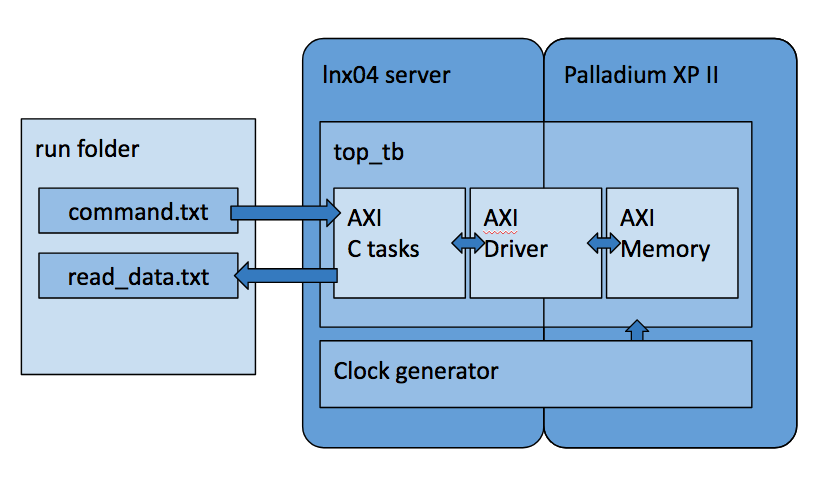

this is a working example of palladium running AXI driver which is controlled by FW commands of C code

### UXE171 (Cadence Palladium package)
an environment variable $UVM_HOME should be added pointing to Cadence UXE (something like /delivery/cadence/uxe/UXE171),as well “$UVM_HOME/tools/bin” should be added to $PATH (these are actually part of the execution script).
Server and Palladium communication
Palladium is physically connected to a server, where all Palladium services are currently up and running.
this demo should be compiled and run on that server (ssh) as some different operations system might cause problems.

### Demo overview
This demo is a small local scenario of palladium model, consist of:
 - AXI memory model (with 12 bit width address)
 - AXI driver
 - Set of C functions to drive the AXI verilog driver

The C code reads a single command from a text file “command.txt”, the commands are:
 - write  address   data  	- for example “write 0x24 0x1234567”
 - read   address 		- for example “read 0xa10” 
 - init			- will force all AXI bus to its reset values
 
The C code is triggered by the AXI driver every clock cycle, so it is constantly looking for a file.
Once a “command.txt” file is found with command different from the last executed, the file will be deleted.
A read command will result in a file “read_data.txt” with the command “read”, the address and the data read from that address.



### Demo Content
Delivery consists of 7 files:
 - palladium.csh - compile and run script
 - axi_tasks.c - C functions to handle the communication
 - axi_driver.sv - verilog AXI Driver model
 - clk.qel - dut clocks to be driven by Palladium
 - dut_wrapper.v - the AXI memory model
 - multf.tcl - run flow definitions and ‘run’ command
 - top_tb.v - virtual layer to wrap all together
 
Everything happens under same location, where the delivery is located.
Results will be generated in ‘results’ folder under the delivery folder.
The main script palladium.csh is a very short script which sets the environment variable, folders, compiles and runs. It’s a good idea to review it line by line.

### Usage
To compile and run the demo design do (“delivery_folder” is full path to where the delivery is located):
```
ssh lnx04
cd delivery_folder
palladium.csh -c -r
```
This will compile and run the design, it will open the “XErun>” terminal.

Now, in another terminal, execute writes and reads by writing and reading files:
```
echo “init” > delivery_folder/results/run/command.txt
echo “write 0x24 0x1234” > delivery_folder/results/run/command.txt
echo “write 0x25 0xabcd” > delivery_folder/results/run/command.txt
echo “read 0x24” > delivery_folder/results/run/command.txt
cat delivery_folder/results/run/read_data.txt
```
